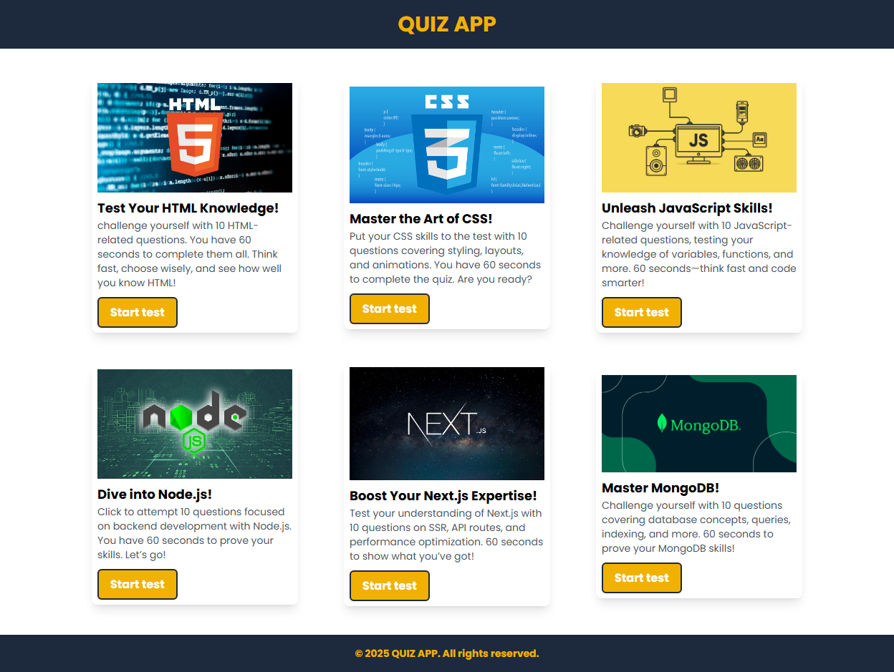
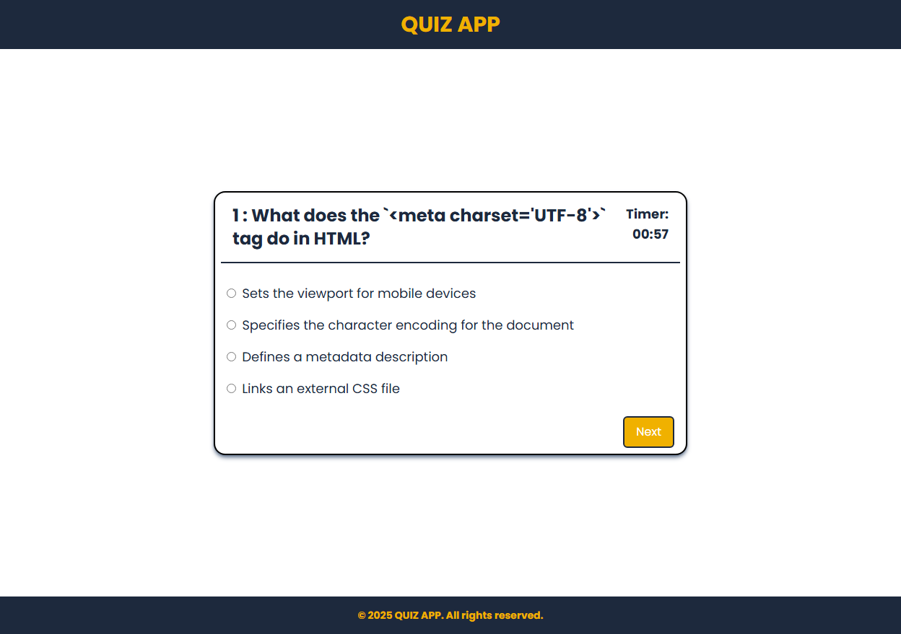

# 🧠 Quiz App

## 📌 Overview

This is a **Quiz App** built with **HTML, Tailwind CSS, and JavaScript**. It allows users to test their knowledge in various **web development** categories, including:

- **HTML**
- **CSS**
- **JavaScript**
- **Node.js**
- **Next.js**
- **MongoDB**

The app features a **card-based interface**, where users can select a category and attempt quizzes with **10 questions** per topic.

---

## 🚀 Features

✅ **Modern UI with Tailwind CSS** – Clean and responsive design.  
✅ **Multiple Categories** – Choose from six different web development topics.  
✅ **Instant Feedback** – Get immediate results after answering questions.  
✅ **Interactive Design** – Clickable cards to start a quiz in each category.  
✅ **Mobile-Friendly** – Fully responsive layout for all devices.

---

## 🛠️ Technologies Used

- **HTML** – Structure of the app
- **Tailwind CSS** – Styling and layout
- **JavaScript** – Logic and interactivity

---

## 📸 Screenshots

### 🏠 Home Page

  
👉 **"Start Test" Card:** Click this button to begin the quiz. It redirects users to the quiz page.

### 📝 Quiz Page


👉 **Quiz Interface:** Users can answer multiple-choice questions and submit responses to see their scores.

---

## 🎮 How to Use

1. Open the **Quiz App** in your browser.
2. Click the **"Start Test"** card to begin.
3. Answer the **10 multiple-choice questions**.
4. Submit your answers to see your **score**.
5. Try again to improve your knowledge!

---

## 💻 Installation & Setup

1. Clone the repository:
   ```bash
   git clone https://github.com/Faizan-Khan-Durrani/Quiz-App
   ```
2. Navigate to the project folder:

   ```
   cd quiz-app
   ```

3. Open index.html in a browser to start the quiz.

---

## 📜 License

This project is open-source and free to use. Feel free to modify and improve it.

## 👨‍💻 Contribution

Want to improve this project? Contributions are welcome!

- Fork the repo
- Create a new branch
- Make your changes
- Submit a Pull Request
